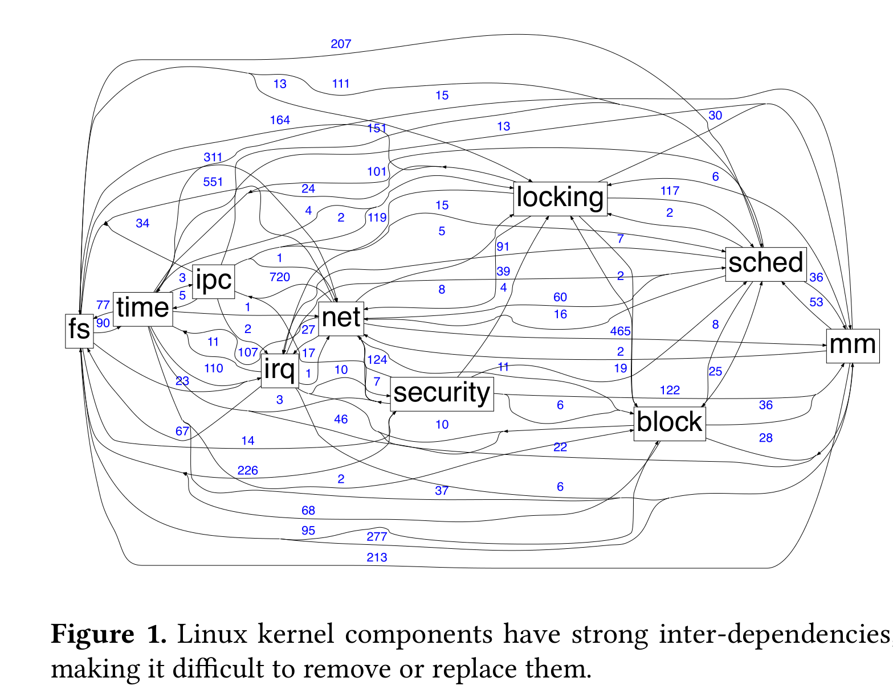
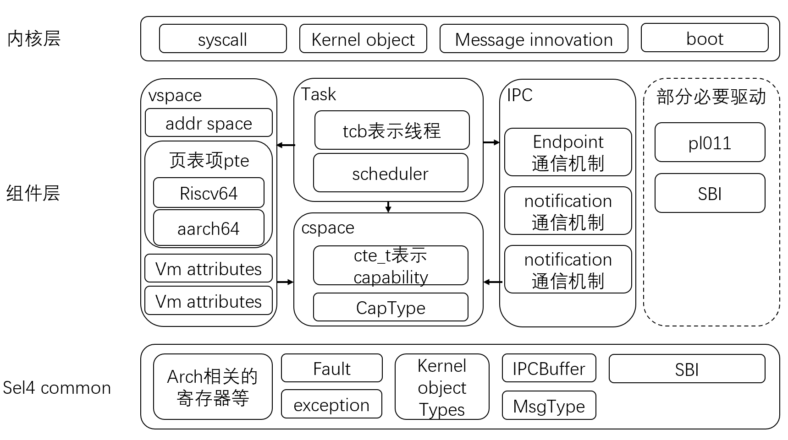
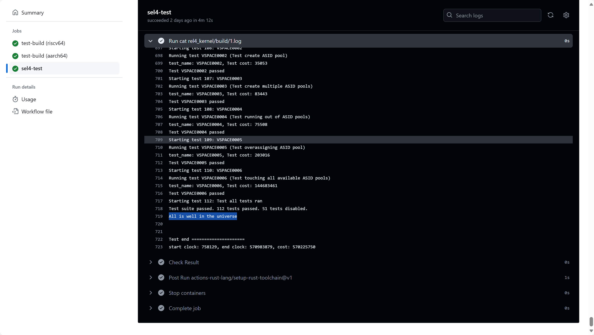

# 组件化内核

## 为什么需要组件化内核

​		正如Unikraft对linux的批评那样，类似于Linux这样的宏内核，各个部分之间的依赖相当紧密[figure 1]，以至于单独替换掉其中一个部分是一项令人生畏的工作。

​		鉴于此，Unikraft率先踏入了完全模块化内核的探索之旅，创新性地以微库形式呈现一系列高度可配置的操作系统功能模块。这一设计赋予了用户前所未有的灵活性，能够轻松地从构建基线中添加或移除所需模块，通过精细组合这些微库，打造出专为特定应用需求量身定制的Unikernel。尤为值得一提的是，Unikraft为这些模块精心设计了清晰定义的API接口，让用户能够基于性能优化、资源最小化等多样化需求，在同一组件的不同实现间做出选择并灵活组合。



​		在当前的IoT（物联网）、智能自动驾驶等前沿领域，实际需求往往聚焦于运行少数几个高度定制化的软件，而非全面依赖一个泛用型操作系统。这些场景常伴随着资源限制、对系统调用速度的高要求以及对实时性的严苛标准。在此背景下，传统Linux宏内核的“大而全”模式显得愈发笨重，难以满足快速变化且多样化的需求。相比之下，组件化操作系统的优势凸显无遗，其卓越的组件可替换性和模块化设计，为精准匹配各类特定场景需求提供了强有力的支持。可以预见的，未来的内核不会是一个完全的自包含系统，而是由诸多可替换组件所构成的灵活的动态的内核。


## 什么是组件化内核

​		组件化，作为软件工程领域的一项核心理念，已在众多实践场景中展现出其非凡的成效与深远影响。起初，组件化的构想聚焦于代码的复用性，旨在通过共享代码片段来加速开发进程。然而，随着这一理念的深化与拓展，每个精心设计的组件不仅承载了特定的功能实现，还配备了标准化的接口，这一转变极大地促进了开发效率的提升、维护成本的降低，以及系统可扩展性和可重用性的显著增强。

​		组件化的实施，为软件开发带来了前所未有的并行处理能力。它鼓励并促进了不同开发者之间的协同作业，使他们能够并行不悖地专注于各自负责的组件开发，有效减少了团队间的依赖与等待时间。这种高度的独立性不仅加速了项目的整体进度，还显著降低了因组件间复杂依赖关系而可能引发的风险。

​		更为重要的是，一个经过精心定义与验证的组件，如同构建软件大厦的预制砖块，能够在多个项目或系统中灵活复用，极大地避免了重复劳动与资源浪费，真正实现了“一次编写，到处运行”的愿景。这种高度的可重用性，不仅提升了开发效率，还确保了代码质量的一致性与稳定性。

​		在后续的维护阶段，组件化的优势同样显著。通过将系统划分为清晰界定的组件，开发者能够更加精准地定位问题所在，从而实施更加高效、精准的修复与升级策略。此外，由于组件间的松耦合设计，对某一组件的单独升级或改造几乎不会影响到系统的其他部分，这极大地降低了维护的复杂性与成本，确保了系统的持续稳定运行。

总之，组件化开发方式以其独特的优势，在大型软件工程的构建中发挥着不可替代的作用。

​		而组件化内核，顾名思义，就是使用组件化的方式来构造内核。它将操作系统的核心——内核，视为一项复杂的软件工程并使用组件化的思想进行编写。在这一过程中，我们打破了传统内核开发的界限，让各个组件独立开来编写，使得程序员能够如同编写普通程序般自如地编写内核模块，极大地提升了开发的灵活性与效率。

​		我们的长远愿景，是通过深入探索与实践组件化内核的构建之道，提炼并总结出一套系统化、可复用的方法论原则。这些原则将不仅指导我们如何高效、有序地组织内核的各个组件，更将作为宝贵的经验财富，为后来者提供明确的指引。同时，我们致力于通过实际案例的展示，向业界证明：在多元化的系统构型环境中，组件化内核设计方法展现出其无与伦比的普适性与强大生命力。无论是面对何种复杂的系统需求，组件化内核都能以其独特的优势，助力我们打造出更加健壮、可扩展且易于维护的操作系统核心。


# 1、SeL4微内核的Rust改造

## SeL4微内核简介

SeL4微内核（[Home | seL4](https://sel4.systems/)）是在L4微内核的基础上增加了安全性而开发的，其具有以下的特点

- 轻量化

  轻量化是微内核天然具有的一个特点，SeL4微内核最初版本的代码仅仅只有8700行。轻量化带来的优势一方面更易于读懂，便于开发者学习，另一方面也减少了运行时的开销。

- 安全性

  SeL4微内核的安全性是通过形式化验证的方式证明的。其首先写出全部微内核对象的抽象规范，将其转换为可执行规范，随后将可执行规范转为C代码，C代码需要转为二进制代码，在这整个过程中，都SeL4都保证了其正确性，从而保证了最终生成的二进制可执行文件的无bug特性。

  同时，SeL4微内核实现了一个称为能力空间（CSpace）的capability-based的模型，基于这个模型，实现了对每个内核对象的细粒度的控制，同时通过能力派生，以及能力检查的控制，保证每个内核对象操作的安全性。

- 高性能

  传统的微内核存在IPC性能损失过大，而微内核架构意味着多个服务模块之间的调用都通过IPC实现，过长的IPC调用链加之单个IPC的较长通信时间，导致微内核存在整体性能不高的问题。

  而L4系列的微内核从提升性能本身出发，提出了一系列更为贴合微内核哲学的设计思想，只保留了地址空间，进程，进程间通信等基本内容在内核中，并实现了基于寄存器的进程间通信。从而大幅度减少了内核态尤其是IPC的开销。

  SeL4微内核作为L4系列微内核的继承者，同样继承了L4系列微内核的高性能的特点，同时，针对于现代CPU的发展，也利用了更多的现代CPU的优势。从而实现了更高的IPC性能。

- 高度可定制化

  除了微内核最为核心的功能之外，其他的系统资源都交给了可定制的root server进程来分配。而内核也仅仅只负责最为基本的功能，因此，内核的其他模块都可以按照用户的需求进行更改并在用户态运行。

## Rust语言的优势

相比于C语言，Rust语言存在其特有的优势

- 内存安全
Rust 通过其所有权（ownership）和借用（borrowing）系统，在编译时自动管理内存，从而避免了如空指针解引用、缓冲区溢出和数据竞争等常见的内存错误。这使得 Rust 成为编写安全、可靠软件的首选语言。
- 高性能
Rust 旨在提供与 C 和 C++ 相媲美的性能，同时保持高级语言的便利性和安全性。Rust 的编译器能够执行深入的优化，并且其零成本抽象（zero-cost abstractions）原则确保高级抽象不会引入运行时开销。
- 并发性
Rust 内置了对并发编程的支持，通过其独特的任务（task）、消息传递和并发所有权模型（如通过 async/await 和 channels），以及无锁数据结构（如原子类型和并发哈希表），Rust 能够安全地编写高效的并发代码。
- 丰富的标准库和生态系统
Rust 的标准库提供了广泛的实用功能，包括集合、字符串处理、I/O、并发和网络编程等。此外，Rust 的生态系统（通过 Cargo 包管理器）也非常活跃，拥有大量的第三方库和工具，支持各种应用场景。
- 清晰的错误处理
Rust 强制要求显式处理错误，通过 Result 类型和 panic/recover 机制，Rust 使得错误处理更加明确和可预测。这有助于开发者编写更健壮、更易于调试的代码。

### Rust语言实现模块化

Rust语言在模块化上仍有其特点。

- 多层次模块系统
  Rust提供了多层次的强大的模块系统。

  一个项目通过工作空间（workspace）管理多个包，而一个包是一个由多个模块组成的树状结构。


- 可见性控制

  对于C/C++这样的语言。一旦Import某个头文件，该头文件下的所有内容都将被看见，这虽然简化了import的工作量，但是也带来了安全性上面的挑战。而Rust则更为细致的对这种可见性进行了控制。

  在Rust中，对模块及模块内的项存在可见性的控制，默认情况下是private的，可以通过`pub`关键字将其变为对模块外的其他模块可见。

  在其他模块引入当前模块定义的符号、函数等内容的时候，在Rust语言中可以像C/C++一样，直接使用`use moudule::*` 即可使用该模块中声明自己为`pub`的所有内容。但是如果不想过多的引入内容，也可以指定使用该模块中的部分内容。

  这种细粒度的可见性控制特性，使得Rust的模块化相比于C/C++等其他系统语言有着更为显著的优势。

## 使用Rust对SeL4微内核进行改造

基于以上的介绍，综合考虑到改造的安全和性能，我们决定将SeL4的aarch64和riscv64部分的代码改造成Rust版本。并在此基础上对SeL4进行模块化的划分。本节剩下的部分会介绍对SeL4进行Rust改造的内容。

我们改造后的整体框架如下图



### Rust和C的兼容层设计

#### 嵌入Rust代码

在改造过程中，我们的做法是，将一部分的Rust代码嵌入到SeL4代码中，进行逐步的替换，从而避免完全性的重构，在这个过程中一步一步验证我们嵌入的代码的正确性，最终替换掉整个SeL4的内核代码。

为此，首先我们修改了部分SeL4的CMake构建脚本。

在`cmakelists.txt`文件中，我们增添了如下代码

```cmake
if(KernelArchRiscV)
    message(STATUS "ARCH ${KernelArchRiscV}")
    link_directories(../rel4_kernel/target/riscv64imac-unknown-none-elf/release)
endif()
if(KernelArchARM)
    message(STATUS "ARCH ${KernelArchARM}")
    link_directories(../rel4_kernel/target/aarch64-unknown-none-softfloat/release)
endif()

arget_link_libraries(kernel.elf PRIVATE kernel_Config kernel_autoconf rustlib)
```

这两段代码的作用，一个是增加这两个路径，另一方面，我们的Rust版本的代码本身在项目的`Cargo.toml`文件中就声明了

```rust
[lib]
name = "rustlib"
path = "src/lib.rs"
crate-type = ["staticlib"]
```

换而言之，这会将自己生成为一个名为rustlib的静态链接库。

随后，我们逐步的使用Rust代码替换掉C中的诸多函数即可。

#### 使用ffi

我们使用ffi的接口来进行C和Rust的兼容。

FFI是一种编程接口，可以让C代码和Rust代码能够相互调用。

对于Rust一端调用C代码，只需要简单的使用

```rust
extern 'C' {
	fn function(args:type)
}
```

等方式即可。

而在Rust端提供C端所需要的代码，则需要在Rust端定义的函数前面加上

```rust
#[no_mangle]
```

用于禁止编译器对函数的重命名

最后，为了便于后期对这些侵入式代码的去除，我们统一将所有这些ffi函数都放在了每个模块中的ffi.rs文件中，并在此约定好，所有使用ffi的函数均进行统一的归纳

### C和Rust的不同语法导致的代码调整

C和Rust具有不同的语言风格，我们不能简单的使用unsafe块对SeL4的代码转译成Rust。以下是一些我们遇到的问题和相应的处理。

#### 使用面向对象的设计

C语言本身是面向过程的一种方法，虽然可以在结构体中加入函数指针等方法来实现面向对象的设计，但其本身的语言设计并不存在面向对象代码模式，更缺少Rust引入生命周期、所有权机制而增加的语法。Rust则不同，为了安全性等原因，其引入了一堆与C不完全一致的代码规则，这些代码规则不仅仅是为了安全性的检查，也不仅仅是可读性的区别，还会一定程度上影响编译器的行为。

以capability中的最基本单元`cte_t`为例：

在C代码中。定义如下

```c
/* Capability table entry (CTE) */
struct cte {
    cap_t cap;
    mdb_node_t cteMDBNode;
};
typedef struct cte cte_t;
```

然而，使用Rust面向对象的方法去重构相关的代码，则将cte_t相关的方法均做一定的封装。

```rust
pub struct cte_t {
    pub cap: cap_t,
    pub cteMDBNode: mdb_node_t,
}

impl cte_t {
	/*functions*/
}
```

而在调用相关函数的时候，则不再填入函数的第一个参数，而是使用该对象的某个方法。

以上只是一个简单的例子，对于其他的C中的函数，我们也做了归类整理，尽量将他们使用面向对象的方法重写。

#### ffi符号兼容

在改造成和C代码兼容的过程中，存在以下问题，部分C代码中的函数已经按照Rust版本的设计，已经变成了某个对象的某个方法（并非某个#[no_mangle]的函数），而在C代码中，又试图使用该符号，这就会导致报错缺少符号定义，这本来是由于没有完全实现Rust代码改造，而又必须使得C和Rust代码兼容导致的问题。

对于这个问题，我们额外补足了这些在链接器中会报符号缺失错误的函数。同时，为了未来的扩展，我们在所有这些地方均增加了注释。

#### Rust未定义行为和unsafe的注意事项

在Rust重构C代码的过程中，由于FFI的存在以及对于操作系统和系统底层细节的控制要求，引入unsafe代码是必然的行为，但是在引入unsafe代码的时候，对于其真实的可能行为必须加以了解，这样才能避免由于unsafe的引入产生bug。

以下是一个例子：

在使用Rust重构C代码的过程中，使用裸指针`*mut T`和`*const T`是非常常见的行为。但是，该行为在Rust中是一个未定义的行为。可以参考

[Warn that `*const T as *mut T` is Undefined Behavior · Issue #66136 · rust-lang/rust (github.com)](https://github.com/rust-lang/rust/issues/66136)

它的某种可能的导致不安全行为的方式（及其原因解释）如下：

这种操作通常来自于对于某个不可变引用，试图为该引用写入某些值。因此需要将其转为const的裸指针，再转为mut的裸指针。

而如果不小心的在某个较短的生命周期的函数中，试图写入这个值，由于他被认为是不可变引用，所以编译器会在某种时候把它优化到栈上，最终把短生命周期中的栈上的内容写入了，随着退栈，最终导致了出错。

在rust的规范中，唯一允许这种情况的是使用UnsafeCell，使用其来封装某个类型来达成内部可变性。（因为对这个类型，做了一定的编译器开窗）

这个问题的模式，一方面要满足需要将某种情况下的裸指针转为const再转为mut类型，同时还需要满足他可能是一个短的生命周期——以至于编译器会在某些优化的情况下将其放置在栈上。

以上只是其中一个Rust未定义行为以及unsafe代码中不小心的操作所引入的问题，同时使用C和Rust代码，意味着不得不使用大量的unsafe代码，SeL4中又使用了大量的64位的usize类型进行转换，这既可以表示为某种指针，也可以表示为页表中的某一个entry等等其他类型。在这个转换过程中必须考虑到Rust代码的语义翻译不出错，也要考虑到不能触发Rust中的不安全行为。

### aarch64和riscv64的多架构支持

根据我们改造的目标，我们需要同时支持满足aarch64和riscv64，在原有的SeL4代码中，也将跟架构相关的代码放置在了一起。

由于我们划分出来的模块没有arch模块，而每个模块中都有大量跟架构相关的代码，因此我们选择在每个模块的文件夹下面增加了一个arch的模块。在这里面集中放置跟arch相关的代码。

一个常见的目录树如下

```
arch
├── aarch64
│   └── some files under aarch64
├── mod.rs
└── riscv64
    └── some files under riscv64
```

而在mod.rs中使用如下代码进行包装

```rust
#[cfg(target_arch = "aarch64")]
mod aarch64;
#[cfg(target_arch = "aarch64")]
pub use aarch64::*;

#[cfg(target_arch = "riscv64")]
mod riscv64;
#[cfg(target_arch = "riscv64")]
pub use riscv64::*;
```

向上提供在某种架构下的代码，供其他模块使用放在某个架构下的代码。

同时，尽管这么做了，但是并不能完全避免在其他部分的代码中包含arch相关的代码，因此，在其他地方我们也会选择使用

```riscv
#[cfg(target_arch = "aarch64")]
#[cfg(target_arch = "riscv64")]
```

来定义专属于某个架构的代码。

# 2、模块化微内核的模块划分方式设计

在上述基础上对微内核进行模块化改造，以及相关的模块化设计的基础之后，开始对reL4微内核进行模块的划分

根据原本SeL4的特点，我们划分并实现了如下的几个模块：common，task，cspace，vspace，ipc，kernel。模块间的依赖关系如下

```
kernel ─┬─> cspace ─┬─> common
        ├─> vspace ─┤
        ├─> task   ─┤
        └─> ipc    ─┘
```

架构上，我们尽可能的让他扁平和简单，防止过于深的依赖链。

过深的依赖链意味着，当其他人试图重用某个模块的时候，不仅需要引入该模块，还需要大量引入该模块所依赖的其他模块，这会显得过于笨重。而由于这些模块通常由其他人提供，通常不存在对这些模块的修改权限，也难以手动削减这部分的依赖关系，这给模块的复用带来了不便。

而相对合适的依赖关系深度，意味着组成操作系统的模块可以简单的使用其依赖的一到两个模块即可。

## 模块划分原则

首先，一个模块的划分要尽量遵循高内聚低耦合的软件工程原则

一个极简的微内核本身需要管理的部分也不过是虚拟地址管理，任务进程管理，以及进程间通讯这三样，而sel4增加了特色的capability，因此cspace也作为其中一个模块。

在此基础上，我们对这些函数查找了归属于这四个模块的方法、结构体定义等内容，并进行手动的划分。除此之外，在实际编码工作当中，我们还根据实际情况来进行了一定的调整，对于多个模块都需要用到的内容，统一放置在common中，防止重复定义等问题。


以下我们展示了分出来的几个模块，对外提供的接口。

## common

这部分的代码主要包括所有模块都依赖的代码。

详细文档可见[sel4_common - Rust (reL4team2.github.io)](https://reL4team2.github.io/sel4_vspace/sel4_common/index.html)

主要还是各种宏，以及各个模块都需要使用到的内容，比如fault中定义了seL4内核中错误的描述

### Macros

| MacroName  | 描述                              |
| ---------- | --------------------------------- |
| BIT        | set some of the bits              |
| IS_ALIGNED | judge whether an value is aligned |
| MASK       | mask some bits                    |
| ROUND_DOWN | round down with an align          |
| ROUND_UP   | round up with an align            |
| print      | print string macro                |
| println    | println string macro              |

### fault

| 结构体定义     | 含义                               |
| -------------- | ---------------------------------- |
| lookup_fault_t | 进行lookup查找过程中产生错误的描述 |
| seL4_Fault_t   | 整个系统中存在错误的情况           |

| 枚举类型定义    | 含义                      |
| --------------- | ------------------------- |
| FaultType       | 对上述Fault的类型进行分类 |
| LookupFaultType | 对lookup错误进行分类      |

常量定义，定义了一堆其他模块可能使用到的常量，包括

- lookup_fault_depth_mismatch
- lookup_fault_guard_mismatch
- lookup_fault_invalid_root
- lookup_fault_missing_capability
- seL4_CapFault_Addr
- seL4_CapFault_BitsLeft
- seL4_CapFault_DepthMismatch_BitsFound
- seL4_CapFault_GuardMismatch_BitsFound
- seL4_CapFault_GuardMismatch_GuardFound
- seL4_CapFault_IP
- seL4_CapFault_InRecvPhase
- seL4_CapFault_LookupFailureType
- seL4_Fault_CapFault
- seL4_Fault_NullFault
- seL4_Fault_UnknownSyscall
- seL4_Fault_UserException
- seL4_Fault_VMFault
- seL4_VMFault_Addr
- seL4_VMFault_FSR
- seL4_VMFault_IP
- seL4_VMFault_Length
- seL4_VMFault_PrefetchFault

### logging

| 方法名 | 含义                                            |
| ------ | ----------------------------------------------- |
| init   | 对于使用的logging模块进行初始化让他可以打印输出 |

### message_info

| 结构体定义         | 含义                            |
| ------------------ | ------------------------------- |
| seL4_MessageInfo_t | 使用多个words表示一段seL4的消息 |

| 枚举定义     | 含义               |
| ------------ | ------------------ |
| MessageLabel | 枚举可能得消息种类 |

### object

| 枚举定义   | 含义                                                         |
| ---------- | ------------------------------------------------------------ |
| ObjectType | 定义了内核对象的种类，包括UnytpedObject,     TCBObject,     EndpointObject,     NotificationObject,     CapTableObject,     GigaPageObject,     NormalPageObject,     MegaPageObject,     PageTableObject, |

### sbi

在这里，封装了riscv的sbi的部分操作

包括

- clear_ipi
- console_getchar
- console_putchar
- get_time
- remote_sfence_vma
- sbi_call
- set_timer
- shutdown
- sys_write

### sel4_config

均为一堆常量定义，不属于其他内容的常量均被定在此处

由于数量众多，不做描述

### structures

| 结构体定义     | 含义          |
| -------------- | ------------- |
| seL4_IPCBuffer | 定义IPCBuffer |

| 枚举定义    | 含义                      |
| ----------- | ------------------------- |
| exception_t | 定义了系统的exception类型 |

### utils

在这里定义了一些工具函数

| 函数名称                       | 含义                             |
| ------------------------------ | -------------------------------- |
| MAX_FREE_INDEX                 |                                  |
| convert_to_mut_type_ref        | 转换为&mut                       |
| convert_to_mut_type_ref_unsafe | 转换为&mut                       |
| convert_to_option_mut_type_ref | 转换为Option\<mut T>             |
| convert_to_option_type_ref     | 转换为Option\<T>                 |
| convert_to_type_ref            | 转换为&T                         |
| cpu_id                         |                                  |
| pageBitsForSize                | 根据page_size获取其定义的bit位数 |


## cspace

这部分主要用于描述reL4的capability的部分。相比之下较为简单

详细文档可见[sel4_cspace - Rust (reL4team2.github.io)](https://reL4team2.github.io/sel4_vspace/sel4_cspace/index.html)

包括compatibility、deps、interface三个模块

compatibility模块是ffi方法做的，这部分后续需要删除，不做赘述

deps是外部需要提供的方法，同样也是ffi实现的，同上

#### interface

interface是暴露给外部的接口

| 结构体定义       |                                                 |
| ---------------- | ----------------------------------------------- |
| cap_t            |                                                 |
| cte_t            | 由cap_t和 mdb_node 组成，是CSpace的基本组成单元 |
| finaliseCap_ret  |                                                 |
| mdb_node_t       |                                                 |
| seL4_CapRights_t |                                                 |

然后又通过CapTag枚举了Cap所有可能的类型

| 枚举类型定义 | 含义                    |
| ------------ | ----------------------- |
| CapTag       | 枚举了Cap所能拥有的类型 |

以及定义了对于cte的操作的函数接口

| 方法名称             | 含义                                          |
| -------------------- | --------------------------------------------- |
| cte_insert           | 将一个cap插入slot中并维护能力派生树           |
| cte_move             | 将一个cap插入slot中并删除原节点               |
| cte_swap             | 交换两个slot，并将新的cap数据填入             |
| insert_new_cap       | 插入一个新的cap                               |
| resolve_address_bits | 从cspace寻址特定的slot                        |
| same_object_as       | 判断两个cap指向的内核对象是否是同一个内存区域 |


## vspace

这部分主要用于描述reL4的地址空间控制相关的内容。
详细文档可见[sel4_vspace - Rust (reL4team2.github.io)](https://reL4team2.github.io/sel4_vspace/sel4_vspace/index.html)

| 方法定义                  | 含义                                                         |
| ------------------------- | ------------------------------------------------------------ |
| RISCV_GET_LVL_PGSIZE      | 获得第n级页表对应的虚拟地址空间的大小 根页表对应2^30=1GB,30位 一级页表对应2^21=2MB，21位 二级页表对应2^12=4KB，12位 |
| RISCV_GET_LVL_PGSIZE_BITS | 获得第n级页表对应的虚拟地址空间的大小位数 根页表对应2^30=1GB,30位 一级页表对应2^21=2MB，21位 二级页表对应2^12=4KB，12位 |
| checkVPAlignment          | 检查页表是否按照4KB对齐                                      |
| delete_asid               | 在asid pool中删除对应的asid, 并设置新使用的页表为default_vspace_cap提供的页表 |
| delete_asid_pool          | 在riscvKSASIDTable中删除对应的asid pool， 并设置新使用的页表为default_vspace_cap提供的页表 |
| find_vspace_for_asid      | 根据给定的asid在riscvKSASIDTable中寻找对应的虚拟地址空间页表基址 |
| get_asid_pool_by_index    | riscvKSASIDSpace寻找对应index的asid pool                     |
| kpptr_to_paddr            | 在reL4内核页表中，内核代码，在内核地址空间中被映射了两次， 一次映射到KERNEL_ELF_BASE开始的虚拟地址上， 由于整个物理地址空间会在内核虚拟地址空间中做一次完整的映射，映射到PPTR_BASE开始的虚拟地址上， 所以会再一次将内核映射地内核地址空间中。 reL4地址空间的布局可以参考map_kernel_window函数的doc 内核本身的指针类型，采用以KERNEL_ELF_BASE_OFFSET 该函数作用就是计算以KERNEL_ELF_BASE开始的内核的虚拟地址的真实物理地址。 |
| maskVMRights              | 当进行进行map操作时，会检查应用程序希望获得的读写权限与frame本身拥有的权限， 依据两者的权限来进行选择，页表项应该具有的权限 |
| paddr_to_pptr             | 计算物理地址对应的虚拟地址，以PPTR_BASE作为偏移              |
| pptr_to_paddr             | 计算以PPTR_BASE作为偏移的指针虚拟地址对应的物理地址          |
| setVSpaceRoot             | 设置页表，创建一个新的satp的值，然后将其写入satp寄存器       |
| set_asid_pool_by_index    | riscvKSASIDSpace设置对应index的asid pool                     |
| sfence                    | 对汇编指令sfence.vma的简单封装，清空cache、tlb               |

结构体定义如下

| 结构体定义      | 含义                                                         |
| --------------- | ------------------------------------------------------------ |
| asid_pool_t     | 用于存放`asid`对应的根页表基址，是一个`usize`的数组，其中`asid`按低`asidLowBits`位进行索引 |
| pte_t           | 页表项（`page table entry`）                                 |
| vm_attributes_t | 进行系统调用时，应用程序向内核传递信息的消息格式             |

除此之外，vspace还提供了对外的interface

#### interface

interface提供了若干个方法，其接口名称及含义如下

| 方法名称               | 含义                                                         |
| ---------------------- | ------------------------------------------------------------ |
| activate_kernel_vspace | 激活内核页表，将`satp`的值设置为内核页表根页表地址           |
| copyGlobalMapping      | 拷贝内核页表到新给出的页表基地址`Lvl1pt`，当创建一个进程的时候，会拷贝一个新的页表给新创建的进程，新的页表中包含内核地址空间 |
| rust_map_kernel_window | 构建`reL4`的内核页表,主要完成了`PSpace`和`KERNEL ELF`两段虚拟地址空间的映射 |
| set_vm_root            | 根据给定的`vspace_root`设置相应的页表，会检查`vspace_root`是否合法，如果不合法默认设置为内核页表 |
| unmapPage              | 清除页表中对应的页表项。                                     |

## ipc

这部分主要包括reL4的ipc部分。主要包括endpoint，notification，transfer三种机制

### endpoint

endpoint是一种基本的通信机制，用于线程（或进程）之间的同步和异步消息传递。endpoint允许线程以发送（Send）、接收（Recv）或回复（Reply）的形式进行通信。这些操作可以通过IPC（Inter-Process Communication）机制实现，允许线程之间安全地交换信息。
在rel4_kernel中，endpoint被表示为一个结构体（通过rust_sel4_pbf_parser脚本生成的），其中包含了队列头部、队列尾部和状态等字段。这些字段用于管理通过endpoint发送和接收消息的tcb队列。EPState枚举定义了endpoint可能的状态，包括：

- Idle：表示endpoint当前没有进行任何消息传递操作。
- Send：表示有线程正在尝试通过endpoint发送消息。
- Recv：表示有线程正在尝试从endpoint接收消息。

#### 方法解读

| 方法名              | 入参                                                         | 行为                                                         |
| ------------------- | ------------------------------------------------------------ | ------------------------------------------------------------ |
| cancel_ipc          | tcb                                                          | 取消该tcb在该endpoint上的ipc操作，如果该tcb是最后一个等待线程，取消后队列为空则将该endpoint的状态改为idle。最后把该线程的状态改为Inactive。 |
| cancel_all_ipc      | 无                                                           | 把该endpoint上所有的等待线程放入调度队列中（取消ipc），并修改调度策略为ChooseNewThread |
| cancel_badged_sends | badge                                                        | 取消该endpoint上所有为badge标记的等待线程ipc，取消后队列为空则将该endpoint的状态改为idle。最后修改调度策略为ChooseNewThread |
| send_ipc            | - src_thread: 发送IPC消息的线程</br>- blocking: 是否阻塞方式发送</br> - do_call: 是否是call方式 </br> - can_grant: 是否授权</br> - can_grant_reply: 是否授权回复 </br> - badge: 标记 | 如果当前endpoint是发送状态，则直接将调度策略修改为ChooseNewThread并将src_thread放入该endpoint的等待队列中。如果endpoint处于Recv状态，这意味着有另一个线程正在等待接收消息。函数首先从endpoint的队列中取出等待接收的线程，然后检查队列是否为空，如果为空，则将端点状态设置为Idle。接下来，执行IPC传输，将消息从源线程传输到目标线程。如果传输是一个调用（do_call为真），并且允许授予权限或回复授予权限，那么会设置caller cap；否则，将源线程的状态设置为Inactive。 |
| receive_ipc         | - thread: 需要接收ipc的线程</br> - is_blocking: 是否阻塞方式接收</br> - grant: 是否授权 | 与send_ipc同理                                               |

### notification

notification是一种用于线程间通信（Inter-Process Communication, IPC）和同步的机制。notification对象可以被视为一种轻量级的信号量，它允许一个线程向一个或多个等待的线程发送信号，从而通知它们某个事件的发生或者某种条件已经满足。
具体来说，notification对象可以处于以下几种状态之一：

- Idle（空闲）：notification对象当前没有被任何线程等待或激活。
- Waiting（等待）：至少有一个线程正在等待notification对象的信号。
- Active（激活）：notification对象已经被激活，但尚未被任何等待线程接收。
  notification对象通过signal操作被激活，当线程执行wait操作时，如果notification已经被激活，则线程会继续执行；如果notification未被激活，则线程会进入等待状态，直到notification被另一个线程激活。

#### 字段解读

| 字段名         | 含义                               | 其他 |
| -------------- | ---------------------------------- | ---- |
| bound_tcb      | 用于表示与通知对象绑定的线程控制块 | -    |
| msg_identifier | 用于存储与通知相关的消息标识符     | -    |

#### 方法解读

| 方法名             | 入参  | 行为                                                         |
| ------------------ | ----- | ------------------------------------------------------------ |
| active             | badge | 将当前对象的状态设置为激活，并将其消息标识符设置为传入的badge值 |
| cancel_signal      | tcb   | 从等待队列中移除该tcb，并更新相关状态，来取消对该tcb的信号。 |
| cacncel_all_signal | -     | 类似上文中endpoint的cancel_all_ipc操作                       |
| send_signal        | badge | 在Idle状态下，函数尝试获取与通知对象绑定的TCB。如果成功获取到TCB，并且该TCB处于ThreadStateBlockedOnReceive状态（即，阻塞等待接收状态），则会取消TCB的当前进程间通信（IPC），将TCB的状态设置为Running（运行），更新TCB的寄存器以存储传入的信号值，最后尝试切换到该TCB。如果TCB不处于阻塞等待接收状态，或者没有绑定的TCB，函数则会调用active方法来激活通知对象并传递信号值。在Waiting状态下，如果队列不空，则取出队头作为接收线程，如果队列变空，则将通知对象的状态设置为Idle。接着，将TCB的状态设置为Running，更新TCB的寄存器以存储传入的信号值，最后尝试切换到该TCB。如果队列为空，则会触发panic。在Active状态下，这表示通知对象已经被激活，将其与传入的信号值进行按位或操作，相当于合并多个信号。 |
| receive_signal     | -     | 与send大致同理                                               |

### transfer

transfer指的是在不同线程或进程之间传输信息、能力（capabilities）或者处理fault（faults）的过程。在给定的代码片段中，transfer是一个trait，定义了一系列与信息传输、能力传递、fault处理和信号完成相关的函数。这些函数允许线程（通过tcb_t结构体表示）之间进行通信和交互。

#### 方法解读

| 方法名                                         | 入参 | 行为                                                         |
| ---------------------------------------------- | ---- | ------------------------------------------------------------ |
| set_transfer_caps & set_transfer_caps_with_buf | -    | 用于设置在消息传递过程中要传输的额外能力（capabilities）。ipc_buffer参数允许传递一个缓冲区，以支持更复杂的传输需求。 |
| do_fault_transfer                              | -    | 当线程遇到fault（如页面错误）时，使用此函数将fault信息传输给另一个线程（通常是错误处理线程） |
| do_normal_transfer                             | -    | 执行常规的信息传输，例如在线程间发送消息。它支持传递一个badge和一个授权标志（can_grant），以控制消息的权限。 |
| do_fault_reply_transfer                        | -    | 在处理完fault后，使用此函数将回复传输给发生fault的线程。     |
| complete_signal                                | -    | 完成信号处理的函数，用于事件或中断处理完成后的信号传递。     |
| do_ipc_transfer                                | -    | 执行进程间通信（IPC）传输，类似于do_normal_transfer，但专门用于IPC场景。 |
| do_reply                                       | -    | 发送回复消息给另一个线程，通常在请求处理完成后使用。         |
| cancel_ipc                                     | -    | 取消当前线程的IPC操作。这通常发生在线程因为某些原因（如超时或任务取消）需要停止等待IPC完成时。 |

## task

这部分主要包括了reL4的进程管理方面的内容

### 切换时机

TCB切换时机：真正的线程调度组合为schedule()+restore_user_context()，其调用时机为系统调用handleSyscall、中断发生handleInterruptEntry、异常发生c_handle_exception。

### thread_state & structures

| 结构体/枚举名称                         | 含义                                                         | 其他 |
| --------------------------------------- | ------------------------------------------------------------ | ---- |
| ThreadState                             | 线程当前状态                                                 |      |
| thread_state_t                          | - blocking_ipc_badge: ipc阻塞时的badge</br>- blocking_ipc_can_grant：ipc阻塞时是否可授权</br> - blocking_ipc_can_grant_relpy：ipc阻塞时是否可授权回复</br>- blocking_ipc_is_call：ipc阻塞时是否是调用</br>- tcb_queued：当前线程是否在队列中</br> - blocking_object：阻塞时阻塞队列的对象，endpoint或notification等 |      |
| ts_type                                 | 线程的state struct                                           |      |
| lookupSlot_raw_ret_t & lookupSlot_ret_t | 寻找Slot的结果                                               |      |

#### tcb

| 方法名                     | 入参                                            | 行为                                                         |
| -------------------------- | ----------------------------------------------- | ------------------------------------------------------------ |
| get_cspace                 | i                                               | 从当前tcb中获取第i个slot                                     |
| set_priority               | priority                                        | 将该线程从队列中弹出，修改其优先级，而后修改调度策略让其重新调度。 |
| set_domain                 | dom                                             | 将该线程从队列中弹出，修改其domain值，而后修改调度策略让其重新调度。 |
| sched_enqueue              | -                                               | 将当前线程放入调度队列，如果当前线程不在队列中，则使用domain和priority计算出所属队列。 |
| get_sched_queue            | index                                           | 获得index对应的就绪队列，只在入队出队时使用该方法用于获得线程所属队列。 |
| sched_dequeue              | -                                               | 将当前线程弹出就绪队列，与sched_enqueue同理                  |
| sched_append               | -                                               | 将当前线程放入所属就绪队列的尾部                             |
| set_vm_root                | -                                               | 修改系统页表为当前线程页表，为后文切换线程打基础             |
| switch_to_this             | -                                               | 页表更新set_vm_root+修改当前线程ksCurThread，为后文的restore_user_context做准备 |
| lookup_slot                | cap_ptr: 要寻找的cap                            | -                                                            |
| setup_reply_master         | -                                               | 创建一个reply cap，如果已经存在则不作操作                    |
| setup_caller_cap           | - sender：发送线程</br> - can_grant：是否可授权 | 它是用于在两个线程之间设置reply capability的。将sender的reply cap插入到接受者self中的caller cap |
| lookup_ipc_buffer          | is_receiver: 当前线程是否是接收者               | 计算出IPC缓冲区的实际内存地址                                |
| lookup_extra_caps          | res：存放cap结果                                | 查找当前线程的ipc buffer中额外的cap                          |
| lookup_extra_caps_with_buf | - res：存放cap结果</br>- buf：已有的ipc buffer  | 查找ipc buffer中额外的cap                                    |
| set_mr                     | - offset：消息偏移</br>- reg：寄存器值          | 如果offset小于msg寄存器数量，则直接放入mr。否则需要放入ipc buffer中 |
| set_lookup_fault_mrs       | 同上                                            | 同上                                                         |
| get_receive_slot           | -                                               | 从当前线程的ipc buffer中找到接收消息的slot                   |
| copy_mrs                   | - receiver：接收者线程</br>- length：消息长度   | 将当前线程的mr和ipc buffer（如果有），复制到receiver中       |
| copy_fault_mrs             | 同上                                            | 同上                                                         |
| copy_fault_mrs_for_reply   | 同上                                            | 同上                                                         |
| set_fault_mrs              | 同set_mr                                        | 同set_mr                                                     |

#### scheduler

| 方法名                  | 入参 | 行为                                                         |
| ----------------------- | ---- | ------------------------------------------------------------ |
| get_ks_scheduler_action | -    | 获得当前调度器行为：1. SchedulerAction_ResumeCurrentThread或SchedulerAction_ChooseNewThread，代表下一步调度行为。2. 否则则是线程指针 |
| get_current_domain      | -    | 获得当前的调度domain                                         |
| getHighestPrio          | -    | 从位图中找到当前domain下的最高优先级                         |
| chooseThread            | -    | 从dom为0的域中选取优先级最高的线程，将其设置为当前线程等待上处理机。 |
| rescheduleRequired      | -    | 修改下次的调度策略为重新选择新线程。                         |
| schedule                | -    | 这是整个调度的入口，使用之前设置的调度策略和优先级等指标进行调度，最终选择一个线程为current，等待后续上处理器；真正的线程调度组合为schedule()+restore_user_context()，其调用时机为系统调用handleSyscall、中断发生handleInterruptEntry、异常发生c_handle_exception。 |
| timerTick               | -    | 当前线程的时间片-1，如果已经没有了则发生调度。该函数只会在时钟中断发生时被调用。 |
| activateThread          | -    | 确保当前线程是激活状态                                       |

## kernel

除了上述模块中所描述的代码均放置在此，细致的分类包括系统boot的代码，中断代码，内核对象，syscall的解析等。由于其不是一个模块，而是内核，因此不在此赘述。

# 3、模块化微内核的模块复用以及模块化开发方式

模块化的一个突出的优点在于，内核将由若干个模块，及使用这些模块的胶水代码拼接而成，对于部分代码模块的复用，可以大幅度减少从头开发一个内核的困难程度，只需要内核开发者，通过少量的代码将其他人开发好的模块进行复用，并专注于自己内核所特有的功能的开发即可。

因此，本节将会描述reL4微内核在模块复用上的相关内容。

## 模块复用

首先使用Rust语言想要使用各个模块，首先需要在根目录中Cargo.toml中指定好对应的模块的位置即可

```
[profile.release]
lto = true

[patch.'https://github.com/reL4team2/driver-collect.git']
driver-collect = { path = "driver-collect" }
[patch.'https://github.com/reL4team2/serial-frame.git']
serial-frame = { path = "serial-frame" }
[patch.'https://github.com/reL4team2/serial-impl-pl011.git']
serial-impl-pl011 = { path = "serial-impl/pl011" }
[patch.'https://github.com/reL4team2/serial-impl-sbi.git']
serial-impl-sbi = { path = "serial-impl/sbi" }
[patch.'https://github.com/reL4team2/sel4_common.git']
sel4_common = { path = "sel4_common" }
[patch.'https://github.com/reL4team2/sel4_cspace.git']
sel4_cspace = { path = "sel4_cspace" }
[patch.'https://github.com/reL4team2/sel4_ipc.git']
sel4_ipc = { path = "sel4_ipc" }
[patch.'https://github.com/reL4team2/sel4_task.git']
sel4_task = { path = "sel4_task" }
[patch.'https://github.com/reL4team2/sel4_vspace.git']
sel4_vspace = { path = "sel4_vspace" }
```

在这里，我们指定了各个模块在本地的位置，也就是根目录下的各个子文件夹。这是便于本地开发而生成的路径，如果想要远程开发，则需要使用patch的方式指定远程的仓库。

同时具体到kernel中的Cargo.toml也需要指定好所依赖的模块的路径

```
[dependencies]
buddy_system_allocator = "0.6"
riscv = { git = "https://github.com/rcore-os/riscv", features = ["inline-asm"] }
aarch64-cpu = "9.4.0"
log = "0.4"
tock-registers = "0.8"
spin = { version = "0.9", features = ["use_ticket_mutex"] }
sel4_common = { git = "https://github.com/reL4team2/sel4_common.git", branch = "master" }
sel4_cspace = { git = "https://github.com/reL4team2/sel4_cspace.git", branch = "master" }
sel4_vspace = { git = "https://github.com/reL4team2/sel4_vspace.git", branch = "master" }
sel4_task = { git = "https://github.com/reL4team2/sel4_task.git", branch = "master" }
sel4_ipc = { git = "https://github.com/reL4team2/sel4_ipc.git", branch = "master" }
driver-collect = { git = "https://github.com/reL4team2/driver-collect.git", branch = "master" }
```

除此之外还指定了比如riscv、aarch64-cpu、log等crate.io中存在的官方仓库。

其次是需要遵循好各个模块所暴露出来的接口

这些接口在上面描述模块划分方法的时候已经定义好了模块对外的方法，因此不做赘述。

## 模块化开发方式

由于每个模块都是具有自己功能的，特定的，独立的仓库，因此，在整个内核的开发过程中，需要同时对多个仓库进行处理。然而，在内核的实际开发过程中，通常需要多位开发者的共同协作，如何在多仓多开发者的环境下对模块进行管理和更新，也同样成为在模块化微内核之外的软件工程上的问题。

为了便于多仓开发，以及针对使用的工具存在的不便捷性，我们前后更换了几种具体的工具来进行管理。我们的模块化仓库的开发方式也是一定程度上基于我们使用的多仓开发工具而确定下来的。

### 简单的git及其协作

最开始，我们选择使用简单的git，具体来说我们维护了一个大仓库，在这个大仓库中，又包含了若干个文件夹（common/cspace/vspace/ipc/task/kernel）用于表示我们的模块。

在这种情况下的协作，最开始是每个人独立的选择一个分支，每个人都维护自己的分支和主分支的同步。

但是这很快出现了问题，具体来说，是由于本身的多人协作，导致若干分支之间互相merge，最终合并到主分支上之后，出现大量的merge冲突，并且曾经出现过的merge代码会重复的merge。同时，在这种情况下，对于主分支的维护者来说也是一个灾难。

为了解决这个问题，我们试图规范化我们的协作。做出如下约定

- git分支不再以每个人维护自己的代码的方式，而是按照某个issue的方式去维护

- 禁止非主分支之间的merge
- 对于其他分支和主分支之间的合并，每次需要提交之前都需要拉取主分支最新的更改，然后合并好之后，再合并回主分支
- 每个人都对各自的提交负责，并完善github的ci。

在这种协作方式下，相比于最开始的无序，协作效率有了一定的提高。

但是对于模块化的目的来说，这种简单的git仓库，并不能很清楚明白的让其他人快速地复用我们的代码，也无法达成我们模块化的目的。

因此很快，我们出于模块化的考虑，将整个代码拆分到了多个子仓库中去。


### repo工具下的协作

在这种方式下，我们试图构建多个小仓库，来达到模块化的目的。同时，为了管理多个小仓库的情况，我们开始寻求别的工具来替代简单的git来进行代码的组织管理，因为这已经涉及到了多个仓库了。

最开始我们瞄准的是github的submodule功能。但是submodule存在以下的局限性：我们的代码本身是在快速演进当中，需要对多个模块的代码进行大规模的调整，使用submodule之后，将我们的更改分发到多个小仓库颇为不便，当然这个问题在各个子模块稳定下来之后会相对好一些。

因此我们调研一圈之后，转而使用repo工具进行仓库的构建

repo本身是google为了开发Android而开发的一个工具，本身也是依托于git，因此并不是对上述简单git仓库的一个直接替换。

对于我们的仓库，只需要

```
repo init -u You_git_addr
repo sync
```

即可快速的同步

然后配置了default.xml文件中配置好每个小仓库的源位置，源分支，目标文件夹，即可实现自动的把小仓库进行拉取，如下所示（限于篇幅只列出部分）：

```
<?xml version="1.0" encoding="UTF-8"?>

<manifest>
	......
    <project name="seL4_libs.git" remote="seL4" path="projects/seL4_libs" revision="2ca525429e7b4f5abbc1fc694d3aeaff5eb6e7db" upstream="master" dest-branch="master"/>
    ......
</manifest>
```

这个时候，每个小仓库内部仍然是一个个独立的git文件夹。

但是，在具体使用的时候，我们仍然出现了诸多问题，针对这些问题，我们也继续演进了协作的方式。

最大的问题同样来自于将本地更改后的代码和远程的多个小仓库进行同步。

由于我们的各个模块仍然还在快速演进当中，所以当某个模块发生变更的时候，必然会对其他诸多模块产生影响，因此一次改动往往涉及多个小仓库。而按照之前约定的协作规范，通常不应该直接向主分支进行commit，而是一如之前约定的那样，push到其他的分支之后，进行合并再提交到主分支。

这导致了一个问题，如果我试图修改多个模块，我就必须在本地调整过代码并验证通过之后，把其他多个小仓库都新建一个分支，进行提交，然后合并到对应小仓库的主分支里面去。这一步，涉及到多个仓库的多个分支以及他们的合并和提交，需要的操作数量过多，导致人类很容易在操作过程中因为漏掉步骤或者敲错代码导致出错。

而一旦出错，需要修复这些个错误，又需要重新涉及到同样类似的操作数量用于修复。这已经变成了一种灾难。

另一个问题是，如果某个人做了一些修改，那么他必须让涉及到多个仓库的事情变成原子的。也就是说，如果某个人A已经提交了一部分子仓库的更新，但是与此同时，其他的人B试图往别的仓库提交，那么这时候，A再试图提交到那些仓库就是错误的行为，因为此时该模块的主分支的最新提交已经合并了A的提交，但是B没有合并进来，就会引起灾难性的问题。

还有一个是关于CI，由于提交了之后，会立即触发某个仓库的CI，然后拉取其他模块的仓库。但是这时候，并不是所有的模块仓库，都已经完成了更新，因此，就存在CI的报错，这个报错是由于提交的同步导致的。所以并不是真正的CI的错误，此时，我们需要手动的让CI重新运行。

为此我们提出了更多的代码协作约定来避免这个问题。

- 不再是单个人负责某个提交，而是需要两个人共同对某个提交进行负责，减少因为一个人的失误导致的问题。
- 由于我们协作的人数非常少，因此，对于一次提交只需要在工作群里说一声，即可让其他人知道某人想要提交，这时候其他人会暂时停止提交。不过这个方法在更大规模下则难以适用。
- 在本地做好测试。


### git-subrepo工具下大仓库和多个小仓库的协作

在这一步，我们并不是完全废弃了repo的工具，而是在此基础上进行了补充

如之前所说，多个模块的问题在于多个小仓库的同时提交存在复杂性。而提交更为简单则是一个简单的大仓库的优点，因此我们再次寻找到git-subrepo工具

我们设计了一个大仓库和对应同步的多个小仓库的方式，用于灵活开发和模块化之间的权衡。

使用这个工具，可以通过简单的

```
git subrepo push sub-module-dir
```

单独push某个模块

也可以正常的跟使用单个大仓库一样使用git方式提交。

同时，我们基于这种工具构建了CI，当在大仓库提交了之后，可以自动的向小仓库进行同步，而如果在小仓库单独进行了修改，也会同步到大仓库中去。

最终我们确定的工作方式如下图所示


# 4、模块化微内核的测试

## 内核的整体测试

由于reL4微内核完全兼容SeL4微内核，因此在ReL4微内核编写过程中，必须通过SeL4微内核自带的测试程序。

由于我们的开发协作都基于github，因此我们增加了github的ci测试，用于自动化的对我们的代码进行调整，小组的代码开发规范中也约定了，必须通过github的CI测试才能够正常的合并进入主分支。

以下是测试的截图：



## 单元测试

模块的单元测试（module check）在模块化过程，以及整体的开发中有着非常重要的作用。

常见的验证代码正确性的方法包括单元测试、模糊测试、形式化验证。

单元测试是自动化测试的一种形式，专注于独立于其他单元的单个模块，通过编写测例来验证单元的行为是否符合对外暴露的接口所定义的行为，从而及早发现并修复单元中存在的问题。具有快速反馈，可以独立运行，易于编写和维护等特性。

模糊测试（fuzzing）同样是一种自动化的软件测试技术，通过向程序提供非预期的输入来发现会导致崩溃和错误的安全漏洞。并通过变异等方式覆盖更多的测试路径。

形式化验证是一种基于数学和逻辑的方法，验证软件系统的某些属性是否成立。SeL4就是通过形式化验证的方式证明其安全性。

从复杂性来说，单元测试最为简单，模糊测试次之，而形式化验证最为复杂，当然其验证的严格性则完全相反。

对于SeL4改造成Rust版本的reL4，不仅仅需要简单的通过SeL4的测试，还需要尽可能的验证其相比于原来的SeL4的安全性。因此，我们第一步就开始针对reL4微内核进行单元测试的验证。

目前已经实现了对部分模块的单元测试工作。

### cspace模块

在cspace文件夹下面运行`cargo test`

即可得到如下结果

```
Running 7 tests
-----------------------------------
Entering cte_insert_test case
Test cte_insert_test passed
-----------------------------------
Entering cte_move_test case
Test cte_move_test passed
-----------------------------------
Entering cte_swap_test case
Test cte_swap_test passed
-----------------------------------
Entering insert_new_cap_test case
Test insert_new_cap_test passed
-----------------------------------
Entering resolve_address_bits_test case
Test resolve_address_bits_test passed
-----------------------------------
Entering same_object_as_test case
Test same_object_as_test passed
-----------------------------------
All Test Cases passed, shutdown
```

#### ipc模块

ipc模块的单元测试在feature/test-check分支

aarch64和riscv64的运行结果如下


